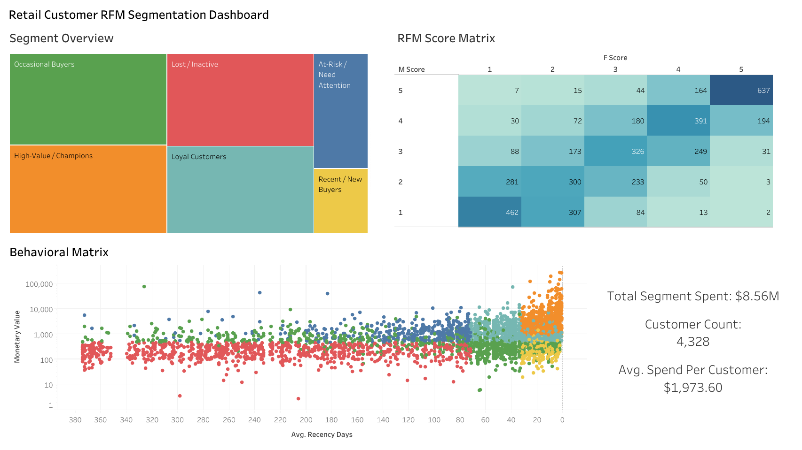
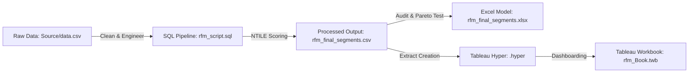

# Retail Customer RFM Segmentation & Business Intelligence


---



---
                                                                                                                                                                                                                        
---

## 🔗 Live Interactive Dashboard
👉 **[View Interactive Dashboard on Tableau Public](https://public.tableau.com/app/profile/devendra.bahadur.singh/viz/rfm_Book/Dashboard1)**

---

## 📌 Executive Summary

This end-to-end analytics project transforms **20,000+ raw transactional records** into strategic customer intelligence. By executing data engineering pipelines in SQL, validating mathematical distributions in Excel, and visualizing behavioral patterns in Tableau, the analysis isolates **4,328 active customers** driving **$8.56M in total revenue**.

The analysis uncovers a classic Pareto distribution—**21.5% of customers drive 65.6% of overall revenue**—while revealing **$711.8K in churn-risk revenue** across 420 "At-Risk" customer accounts.

---

## 📂 Project Structure

```text
.
├── Source/
│   └── data.csv                                  # Raw e-commerce transaction logs
├── rfm_script.sql                                 # MySQL data cleaning, aggregation & NTILE scoring script
├── rfm_final_segments.csv                         # Final processed dataset with RFM scores & segment labels
├── rfm_final_segments.xlsx                        # Excel audit model with dynamic pivot tables & validations
├── rfm_Book.twb                                   # Tableau Workbook file containing dashboard layout
└── rfm_final_segments (rfm_final_segments).hyper  # Tableau extract file for optimized query performance
```

---

## 🛠️ Data Pipeline & Technical Architecture



### 1. Data Engineering & Preprocessing (`rfm_script.sql`)
- Filtered non-transactional items, cancelled invoices (C% pattern), null customer identifiers, and zero/negative unit pricing.
- Consolidated total line-item order values and calculated recency relative to the max transactional baseline date.
- Computed Recency (days since last purchase), Frequency (distinct invoice count), and Monetary (total customer spend) metrics per account.
- Applied `NTILE(5)` window functions across R, F, and M distributions to rank accounts from 1 to 5.

### 2. Validation & Quality Control (`rfm_final_segments.xlsx`)
- Constructed two dynamic pivot tables to verify cross-tabulation across $M$ and $F$ score bands.
- Verified that segment aggregation totals ($8.56M revenue, 4,328 distinct accounts) matched database metrics with 100% accuracy.

### 3. Interactive Business Intelligence (`rfm_Book.twb`)
- Engineered a multi-sheet Tableau dashboard with cross-filtering actions across:
  - **Customer Segment Treemap**: Visualizing revenue and customer density per cohort.
  - **5x5 RFM Score Matrix Heatmap**: Mapping detailed score combinations.
  - **Logarithmic Spend Scatter Plot**: Plotting Recency vs. Spend across individual accounts.
  - **Dynamic Executive KPI Cards**: Summarizing real-time segment revenue, customer counts, and average customer lifetime value.

---

## 📊 Customer Cohort Breakdown

| Customer Segment | Customer Count | Customer Share (%) | Total Revenue ($) | Revenue Share (%) | Avg CLV ($) | Primary Strategic Focus |
| :--- | :---: | :---: | :---: | :---: | :---: | :--- |
| **High-Value / Champions** | 934 | 21.47% | $5,613,199.29 | 65.59% | $6,009.85 | VIP loyalty perks, early product access |
| **Loyal Customers** | 862 | 19.82% | $1,340,010.25 | 15.66% | $1,554.54 | Cross-sell higher-margin categories |
| **At-Risk / Need Attention** | 420 | 9.67% | $711,752.17 | 8.32% | $1,694.65 | Automated win-back discount campaigns |
| **Occasional Buyers** | 970 | 22.38% | $605,905.89 | 7.08% | $624.65 | Post-purchase incentives & free shipping thresholds |
| **Lost / Inactive** | 914 | 21.18% | $210,670.71 | 2.46% | $230.49 | Low-cost automated email retargeting |
| **Recent / New Buyers** | 236 | 5.47% | $75,976.21 | 0.89% | $321.93 | 30-day onboarding drip series |

---

## 💡 Key Business Insights

- **Pareto Revenue Distribution:** High-Value Champions generate $5.61M (65.59%) of overall revenue despite representing only 21.47% of the customer base.
- **Significant Revenue at Risk:** The At-Risk / Need Attention segment contains 420 formerly active high-spending customers representing $711.8K in historical value, with an average recency gap exceeding 120 days.
- **Expansion Opportunity:** Occasional Buyers form the largest single group (970 accounts / 22.38%), but average only $624.65 in spend, offering a prime target for basket-building promotions.

---

## 🚀 How to Reproduce Locally

### 1. Clone the Repository
```bash
git clone https://github.com/YOUR_USERNAME/YOUR_REPO_NAME.git
cd YOUR_REPO_NAME
```

### 2. Execute SQL Script
- Import `Source/data.csv` into your MySQL instance (`rfm_db`).
- Execute `rfm_script.sql` to generate the segmented output.

### 3. Explore Dashboard & Data
- Open `rfm_final_segments.xlsx` to review pivot tables and cohort summaries.
- Open `rfm_Book.twb` in Tableau Desktop / Public to interact with the visual dashboard.

---

## 👤 Author

**Devendra Bahadur Singh**  
Tableau Public: [@devendra.bahadur.singh](https://github.com/Devendra-Bahadur-Singh)
